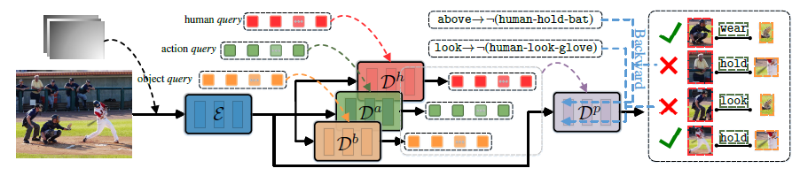

# LogicHOI
Code for our NeurIPS 2023 paper "[Neural-Logic Human-Object Interaction Detection](https://arxiv.org/abs/2311.09817)".

Contributed by Liulei Li, Jianan Wei, Wenguan Wang, Yi Yang.



## Installation
Installl the dependencies.
```
pip install -r requirements.txt
```

## Data preparation

### HICO-DET
HICO-DET dataset can be downloaded [here](https://drive.google.com/file/d/1dUByzVzM6z1Oq4gENa1-t0FLhr0UtDaS/view). After finishing downloading, unpack the tarball (`hico_20160224_det.tar.gz`) to the `data` directory.

Instead of using the original annotations files, we use the annotation files provided by the PPDM authors. The annotation files can be downloaded from [here](https://drive.google.com/open?id=1WI-gsNLS-t0Kh8TVki1wXqc3y2Ow1f2R). The downloaded annotation files have to be placed as follows.
```
data
 └─ hico_20160224_det
     |─ annotations
     |   |─ trainval_hico.json
     |   |─ test_hico.json
     |   └─ corre_hico.npy
     :
```

### V-COCO
First clone the repository of V-COCO from [here](https://github.com/s-gupta/v-coco), and then follow the instruction to generate the file `instances_vcoco_all_2014.json`. Next, download the prior file `prior.pickle` from [here](https://drive.google.com/drive/folders/10uuzvMUCVVv95-xAZg5KS94QXm7QXZW4). Place the files and make directories as follows.
```
GEN-VLKT
 |─ data
 │   └─ v-coco
 |       |─ data
 |       |   |─ instances_vcoco_all_2014.json
 |       |   :
 |       |─ prior.pickle
 |       |─ images
 |       |   |─ train2014
 |       |   |   |─ COCO_train2014_000000000009.jpg
 |       |   |   :
 |       |   └─ val2014
 |       |       |─ COCO_val2014_000000000042.jpg
 |       |       :
 |       |─ annotations
 :       :
```
For our implementation, the annotation file have to be converted to the HOIA format. The conversion can be conducted as follows.
```
PYTHONPATH=data/v-coco \
        python convert_vcoco_annotations.py \
        --load_path data/v-coco/data \
        --prior_path data/v-coco/prior.pickle \
        --save_path data/v-coco/annotations
```
Note that only Python2 can be used for this conversion because `vsrl_utils.py` in the v-coco repository shows a error with Python3.

V-COCO annotations with the HOIA format, `corre_vcoco.npy`, `test_vcoco.json`, and `trainval_vcoco.json` will be generated to `annotations` directory.


## Pre-trained model
Download the pretrained model of DETR detector for [ResNet50](https://dl.fbaipublicfiles.com/detr/detr-r50-e632da11.pth), and put it to the `params` directory.
```
python ./tools/convert_parameters.py \
        --load_path params/detr-r50-e632da11.pth \
        --save_path params/detr-r50-pre-2branch-hico.pth \
        --num_queries 64

python ./tools/convert_parameters.py \
        --load_path params/detr-r50-e632da11.pth \
        --save_path params/detr-r50-pre-2branch-vcoco.pth \
        --dataset vcoco \
        --num_queries 64
```

## Training
After the preparation, you can start training with the following commands.
### HICO-DET
```
sh ./config/hico.sh
```

### V-COCO
```
sh ./configs/vcoco.sh
```

## Citation
Please consider citing our paper if it helps your research.
```
@article{li2024neural,
  title={Neural-logic human-object interaction detection},
  author={Li, Liulei and Wei, Jianan and Wang, Wenguan and Yang, Yi},
  journal={Advances in Neural Information Processing Systems},
  volume={36},
  year={2024}
}
```

## License
LogicHOI is released under the MIT license. See [LICENSE](./LICENSE) for additional details.

## Acknowledge
Some of the codes are built upon [DETR](https://github.com/facebookresearch/detr) and [GEN-VLKT](https://github.com/YueLiao/gen-vlkt). Thanks them for their great works!


